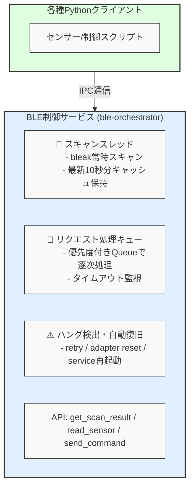

# BLE Orchestrator

BLE Orchestratorは、BLE（Bluetooth Low Energy）デバイスの操作を集約して制御する常駐型サービスです。複数のPythonスクリプトからBluetooth操作を安全に行うための仕組みが必要だったので作りました。

## 背景・目的

BLEデバイスからセンサーデータを収集したり、Bluetooth経由でスマートプラグをON/OFF制御するPythonスクリプトが複数あった場合に、`bleak`ライブラリを複数プロセスで同時利用することでハングが発生する問題がありました。

この問題を解消するため、**BLE操作を集約して制御する常駐型サービス（BLE Orchestrator）**を開発し、複数スクリプトから安全にBluetooth操作できる構成を提供します。

## 機能

- 複数スクリプトからBLE操作要求を受け付けるIPCサービス
- スキャン結果を10秒分メモリに保持し、キャッシュ参照で即時応答
- PlugminiなどへのBLEコマンド送信
- BLEハング時の自動リカバリ（アダプタリセット、bluetooth再起動）
- 優先度付きリクエスト処理
- systemdによる自動起動・再起動サポート

## システム構成

```
+---------------------------+
|   各種Pythonクライアント   |
| (センサー/制御スクリプト) |
+---------------------------+
             │ IPC通信
             ▼
+--------------------------------------------+
| BLE制御サービス (ble-orchestrator)         |
|--------------------------------------------|
| 🔄 スキャンスレッド                         |
|    - bleak常時スキャン                      |
|    - 最新10秒分キャッシュ保持               |
|--------------------------------------------|
| 🧭 リクエスト処理キュー                     |
|    - 優先度付きQueueで逐次処理              |
|    - タイムアウト監視                       |
|--------------------------------------------|
| ⚠️ ハング検出・自動復旧                      |
|    - retry / adapter reset / service再起動  |
|--------------------------------------------|
| API: get_scan_result / read_sensor / send_command |
+--------------------------------------------+
```



## インストール

### 必要環境

- Python 3.9以上
- Bluetoothアダプタを持つRaspberry piマシン

### セットアップ

```bash
# リポジトリをクローン
git clone https://github.com/username/ble-orchestrator.git
cd ble-orchestrator

# 仮想環境の作成と有効化
python3 -m venv venv
source venv/bin/activate

# 依存パッケージのインストール
pip install -r requirements.txt
```

### systemdによる自動起動設定（Linux）

```bash
# systemdユニットファイルの場所を編集
sed -i "s|/path/to/ble_orchestrator|$(pwd)|g" ble_orchestrator/systemd/ble-orchestrator.service

# systemdにユニットファイルをコピー
sudo cp ble_orchestrator/systemd/ble-orchestrator.service /etc/systemd/system/

# systemdを再読み込み
sudo systemctl daemon-reload

# サービスを有効化
sudo systemctl enable ble-orchestrator.service

# サービスを開始
sudo systemctl start ble-orchestrator.service

# ステータス確認
sudo systemctl status ble-orchestrator.service
```

## 使用方法

### サービスの起動

手動で起動する場合は以下のコマンドを実行します：

```bash
python -m ble_orchestrator.main
```

### クライアントライブラリの使用例

```python
import asyncio
from ble_orchestrator.client import BLEOrchestratorClient

async def main():
    # クライアント初期化（Unix socketまたはTCP接続）
    client = BLEOrchestratorClient()
    
    # コンテキストマネージャーで接続管理
    async with client:
        # スキャン結果取得
        scan_result = await client.get_scan_result("AA:BB:CC:DD:EE:FF")
        print(f"Scan result: {scan_result}")
        
        # センサー読み取り
        request_id = await client.read_sensor(
            mac_address="AA:BB:CC:DD:EE:FF",
            service_uuid="0000180f-0000-1000-8000-00805f9b34fb",
            characteristic_uuid="00002a19-0000-1000-8000-00805f9b34fb",
            priority="HIGH"
        )
        print(f"Read request ID: {request_id}")
        
        # コマンド送信
        command_id = await client.send_command(
            mac_address="AA:BB:CC:DD:EE:FF",
            service_uuid="0000180f-0000-1000-8000-00805f9b34fb",
            characteristic_uuid="00002a19-0000-1000-8000-00805f9b34fb",
            data="0100",  # 16進数文字列
            response_required=True
        )
        print(f"Command request ID: {command_id}")
        
        # サービスのステータス取得
        status = await client.get_service_status()
        print(f"Service status: {status}")

if __name__ == "__main__":
    asyncio.run(main())
```

## APIリファレンス

| API名 | 処理内容 | 備考 |
|-------|----------|------|
| `get_scan_result(mac)` | キャッシュからスキャン結果を即時返却 | 非同期処理可能 |
| `read_sensor(mac, service_uuid, characteristic_uuid)` | センサー情報の取得（例：温湿度） | 排他処理あり |
| `send_command(mac, service_uuid, characteristic_uuid, data)` | PlugminiなどへBLEコマンド送信 | 優先度対応 |
| `get_request_status(request_id)` | リクエストの処理状況を確認 | - |
| `get_service_status()` | BLEアダプタやサービスの稼働状況 | ヘルスチェック用途 |

## ライセンス

MITライセンス

## 貢献

バグ報告や機能要望は、Issueを作成してください。プルリクエストも歓迎します。
