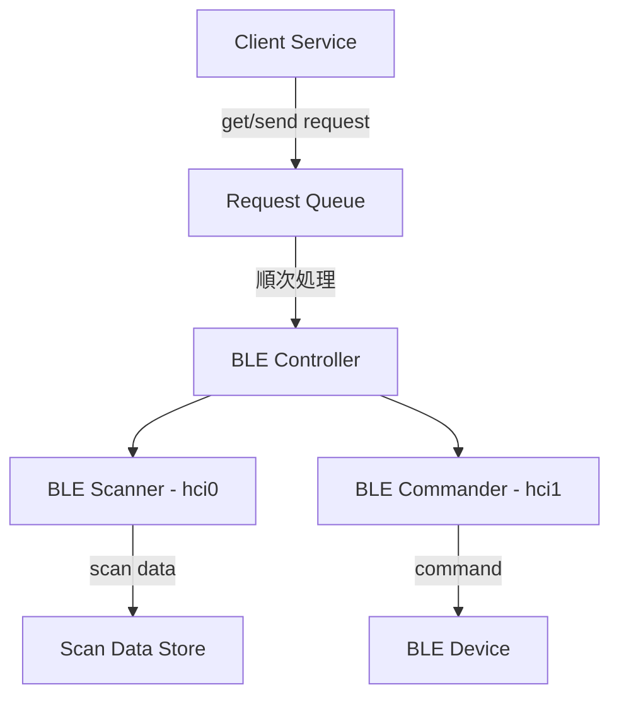

# BLE Controller

Bluetooth Low Energy (BLE) デバイスを制御するためのサービスです。

## 概要

BLE Controller は以下の機能を提供します：

1. BLE デバイスのスキャン (hci0)
2. BLE デバイスへのコマンド送信 (hci1)
3. リクエストキューによる並行処理の制御

## アーキテクチャ



## 機能詳細

### 1. リクエストキューシステム

リクエストを安全に管理し、順序立てて処理するキューシステムを実装しています。

#### 特徴
- 優先順位付きキュー管理
- タイムスタンプベースの順序制御
- 非同期処理による順次実行
- エラーハンドリング

#### RequestTaskインターフェース
```typescript
interface RequestTask {
  id: string;          // タスクの一意識別子
  type: 'GET' | 'SEND'; // リクエストタイプ
  priority?: number;    // 優先順位（高いほど優先）
  url: string;         // リクエスト先URL
  payload?: any;       // SENDリクエスト時のデータ
  timestamp: number;   // タスク作成時のタイムスタンプ
}
```

#### 優先順位の仕組み
1. 優先順位の高いタスクが先に処理（priorityの値が大きいほど優先）
2. 同じ優先順位の場合は、タイムスタンプが古いものが優先
3. priorityが未指定の場合は0として扱う

### 2. BLE スキャナー (hci0)

- hci0 アダプタを使用
- 継続的に BLE デバイスをスキャン
- スキャンデータを内部ストアに保存
- データ保持期間: 最新10秒間のデータ

### 3. BLE コマンダー (hci1)

- hci1 アダプタを使用
- クライアントからの要求に応じてデバイスに接続
- コマンドを実行して結果を返却
- 実行後は接続を解除

## API

### GET リクエスト

スキャンデータの取得

```typescript
// Request
const getTask: RequestTask = {
    id: '1',
    type: 'GET',
    url: 'https://api.example.com/data',
    priority: 1,
    timestamp: Date.now()
};

// Response
{
    "status": "success",
    "data": [
        {
            "address": "XX:XX:XX:XX:XX:XX",
            "name": "Device Name",
            "rssi": -70,
            "timestamp": "2024-03-20T10:00:05",
            "manufacturer_data": {...}
        },
        ...
    ]
}
```

### SEND リクエスト

BLE デバイスへのコマンド送信

```typescript
// Request
const sendTask: RequestTask = {
    id: '2',
    type: 'SEND',
    url: 'https://api.example.com/data',
    payload: { 
        address: "XX:XX:XX:XX:XX:XX",
        command: "turn_on",
        parameters: {...}
    },
    priority: 2,
    timestamp: Date.now()
};

// Response
{
    "status": "success",
    "result": {...}
}
```

## エラーハンドリング

- デバイス未発見
- 接続タイムアウト
- コマンド実行エラー
- アダプタ利用不可
- リクエストキューのエラー

## 使用例

```typescript
import { RequestQueue } from './services/RequestQueue';
import { RequestTask } from './types/RequestTask';

// キューのインスタンス化
const requestQueue = new RequestQueue();

// GETリクエストの作成と実行
const getTask: RequestTask = {
    id: '1',
    type: 'GET',
    url: 'https://api.example.com/data',
    priority: 1,
    timestamp: Date.now()
};

requestQueue.enqueue(getTask);
```

## 依存関係

- bleak: BLE 通信ライブラリ
- asyncio: 非同期処理
- TypeScript: 型システムとコンパイラ

## 今後の改善予定

- [ ] リトライ機能の追加
- [ ] タイムアウト設定の実装
- [ ] キューの最大サイズ制限
- [ ] 処理状況のモニタリング機能

## ライセンス
MIT
