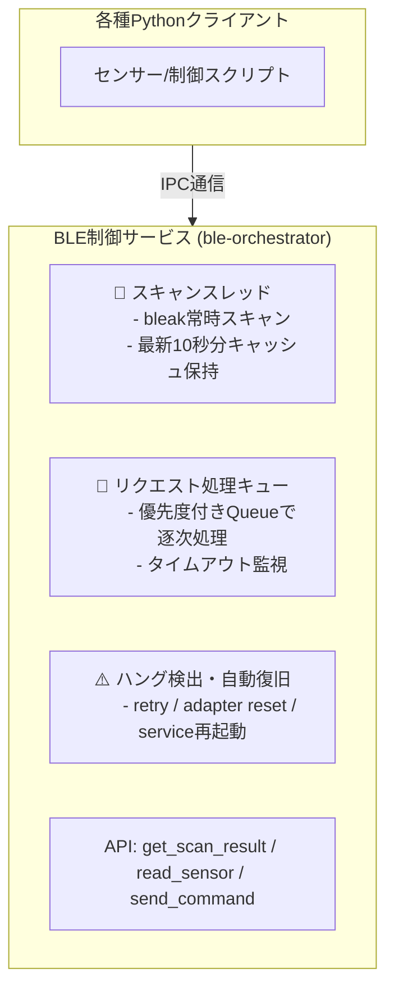

# BLE Orchestrator

BLE Orchestratorは、BLE（Bluetooth Low Energy）デバイスの操作を集約して制御する常駐型サービスです。複数のPythonスクリプトからBluetooth操作を安全に行うための仕組みが必要だったので作りました。

## 背景・目的

BLEデバイスからセンサーデータを収集したり、Bluetooth経由でスマートプラグをON/OFF制御するPythonスクリプトが複数あった場合に、`bleak`ライブラリを複数プロセスで同時利用することでハングが発生する問題がありました。

この問題を解消するため、**BLE操作を集約して制御する常駐型サービス（BLE Orchestrator）**を開発し、複数スクリプトから安全にBluetooth操作できる構成を提供します。

## 機能

- 複数スクリプトからBLE操作要求を受け付けるIPCサービス
- スキャン結果を10秒分メモリに保持し、キャッシュ参照で即時応答
- PlugminiなどへのBLEコマンド送信
- BLEハング時の自動リカバリ（アダプタリセット、bluetooth再起動）
- **BleakClient失敗時の軽量アダプタリセット（hciconfig reset）**
- 優先度付きリクエスト処理
- **スキャナーとクライアントの排他制御（BlueZ競合防止）**
- systemdによる自動起動・再起動サポート

### BleakClient失敗時の自動復旧機能

BLE接続が失敗した場合、以下の軽量な復旧処理が自動実行されます：

1. **BleakClient失敗検知**: リトライ回数上限に達した場合に自動検知
2. **軽量アダプタリセット**: `hciconfig hci0 down && hciconfig hci0 up` を実行
3. **Bluetoothサービス再起動なし**: 軽量な復旧のため、サービス再起動は行わない
4. **失敗カウンタリセット**: 復旧完了後に失敗カウンタをリセット

この機能により、BLE接続の問題を素早く解決し、システムの安定性を向上させます。

## システム構成



## インストール

### 必要環境

- Python 3.9以上
- Bluetoothアダプタを持つRaspberry piマシン

### セットアップ

#### 推奨: 仮想環境を使用したインストール

Raspberry Pi OS（Bullseye以降）では、システム管理環境が保護されているため、仮想環境の使用を推奨します。

##### 簡易インストール（推奨）

```bash
# リポジトリをクローン
git clone https://github.com/username/ble-orchestrator.git
cd ble-orchestrator

# 仮想環境を作成してインストール
./install_venv.sh
```

##### 詳細インストール

```bash
# リポジトリをクローン
git clone https://github.com/username/ble-orchestrator.git
cd ble-orchestrator

# 自動ビルド・インストールスクリプトを実行
./build_and_install.sh
# 選択肢1または2を選択（仮想環境内にインストール）
```

##### 手動インストール

```bash
# リポジトリをクローン
git clone https://github.com/username/ble-orchestrator.git
cd ble-orchestrator

# 仮想環境の作成と有効化
python3 -m venv venv
source venv/bin/activate

# 依存パッケージのインストール
pip install -r requirements.txt

# パッケージを開発モードでインストール
pip install -e .
```

#### システム全体へのインストール（非推奨）

⚠️ **警告**: システム全体にインストールすると、システムの安定性に影響を与える可能性があります。

```bash
# リポジトリをクローン
git clone https://github.com/username/ble-orchestrator.git
cd ble-orchestrator

# システム全体にインストール
sudo pip install --break-system-packages .
```

### systemdによる自動起動設定（Linux）

#### 仮想環境を使用する場合

```bash
# systemdユニットファイルの場所とPythonパスを編集
sed -i "s|/path/to/ble_orchestrator|$(pwd)|g" ble_orchestrator/systemd/ble-orchestrator.service
sed -i "s|python3|$(pwd)/venv/bin/python|g" ble_orchestrator/systemd/ble-orchestrator.service

# systemdにユニットファイルをコピー
sudo cp ble_orchestrator/systemd/ble-orchestrator.service /etc/systemd/system/

# systemdを再読み込み
sudo systemctl daemon-reload

# サービスを有効化
sudo systemctl enable ble-orchestrator.service

# サービスを開始
sudo systemctl start ble-orchestrator.service

# ステータス確認
sudo systemctl status ble-orchestrator.service
```

#### システム全体にインストールした場合

```bash
# systemdユニットファイルの場所を編集
sed -i "s|/path/to/ble_orchestrator|$(pwd)|g" ble_orchestrator/systemd/ble-orchestrator.service

# systemdにユニットファイルをコピー
sudo cp ble_orchestrator/systemd/ble-orchestrator.service /etc/systemd/system/

# systemdを再読み込み
sudo systemctl daemon-reload

# サービスを有効化
sudo systemctl enable ble-orchestrator.service

# サービスを開始
sudo systemctl start ble-orchestrator.service

# ステータス確認
sudo systemctl status ble-orchestrator.service
```

## 使用方法

### サービスの起動

#### 仮想環境を使用する場合

```bash
# 仮想環境をアクティベート
source venv/bin/activate

# サービスを起動
python -m ble_orchestrator
```

#### 直接実行

```bash
# 仮想環境をアクティベートせずに直接実行
venv/bin/python -m ble_orchestrator
```

#### システム全体にインストールした場合

```bash
# コマンドラインから起動
ble-orchestrator

# または
python -m ble_orchestrator
```

### クライアントライブラリの使用例

```python
import asyncio
from ble_orchestrator.client import BLEOrchestratorClient

async def main():
    # クライアント初期化（Unix socketまたはTCP接続）
    client = BLEOrchestratorClient()
    
    # コンテキストマネージャーで接続管理
    async with client:
        # スキャン結果取得
        scan_result = await client.get_scan_result("AA:BB:CC:DD:EE:FF")
        print(f"Scan result: {scan_result}")
        
        # センサー読み取り
        request_id = await client.read_sensor(
            mac_address="AA:BB:CC:DD:EE:FF",
            service_uuid="0000180f-0000-1000-8000-00805f9b34fb",
            characteristic_uuid="00002a19-0000-1000-8000-00805f9b34fb",
            priority="HIGH"
        )
        print(f"Read request ID: {request_id}")
        
        # コマンド送信
        command_id = await client.send_command(
            mac_address="AA:BB:CC:DD:EE:FF",
            service_uuid="0000180f-0000-1000-8000-00805f9b34fb",
            characteristic_uuid="00002a19-0000-1000-8000-00805f9b34fb",
            data="0100",  # 16進数文字列
            response_required=True
        )
        print(f"Command request ID: {command_id}")
        
        # サービスのステータス取得
        status = await client.get_service_status()
        print(f"Service status: {status}")

if __name__ == "__main__":
    asyncio.run(main())
```

## APIリファレンス

| API名 | 処理内容 | 備考 |
|-------|----------|------|
| `get_scan_result(mac)` | キャッシュからスキャン結果を即時返却 | 非同期処理可能 |
| `read_sensor(mac, service_uuid, characteristic_uuid)` | センサー情報の取得（例：温湿度） | 排他処理あり |
| `send_command(mac, service_uuid, characteristic_uuid, data)` | PlugminiなどへBLEコマンド送信 | 優先度対応 |
| `get_request_status(request_id)` | リクエストの処理状況を確認 | - |
| `get_service_status()` | BLEアダプタやサービスの稼働状況 | ヘルスチェック用途 |

## トラブルシューティング

### よくある問題

1. **externally-managed-environmentエラー**
   ```bash
   # 解決策: 仮想環境を使用
   python3 -m venv venv
   source venv/bin/activate
   pip install .
   ```

2. **パッケージが見つからない**
   ```bash
   # 仮想環境がアクティベートされているか確認
   echo $VIRTUAL_ENV
   
   # パッケージ情報を確認
   pip show ble-orchestrator
   ```

詳細なトラブルシューティングについては、[PACKAGING.md](PACKAGING.md)を参照してください。

## 排他制御機能

BLE Orchestratorは、検証スクリプト `tests/test_ble_scanner_stability_2.py` の排他制御メカニズムを参考に、**スキャナーとクライアントの排他制御機能**を実装しています。

### 背景

BLEデバイスのスキャンとクライアント接続を同時に行うと、BlueZレベルでリソース競合が発生し、以下の問題が起きる可能性があります：

- BLEアダプタのハング
- 接続失敗の増加
- システム全体のBluetooth機能の不安定化

### 排他制御メカニズム

1. **スキャナー停止要求**: クライアント接続前にスキャナーに停止を要求
2. **イベントベース同期**: `scan_ready`, `scan_completed`, `client_completed`イベントで同期
3. **自動再開**: クライアント処理完了後にスキャナーを自動再開
4. **設定可能**: `config.py`で排他制御の有効/無効を制御

### 設定

```python
# ble_orchestrator/orchestrator/config.py
EXCLUSIVE_CONTROL_ENABLED = True  # 排他制御の有効/無効
EXCLUSIVE_CONTROL_TIMEOUT_SEC = 30.0  # 排他制御のタイムアウト（秒）
```

### 動作確認

排他制御機能の動作確認には、専用のテストスクリプトを使用できます：

```bash
# 排他制御機能のテスト
python tests/test_exclusive_control.py
```

### ステータス監視

サービスステータスで排他制御の状態を確認できます：

```python
status = await client.get_service_status()
print(f"Exclusive control enabled: {status['exclusive_control_enabled']}")
print(f"Client connecting: {status['client_connecting']}")
```

## ライセンス

MITライセンス

## 貢献

バグ報告や機能要望は、Issueを作成してください。プルリクエストも歓迎します。
