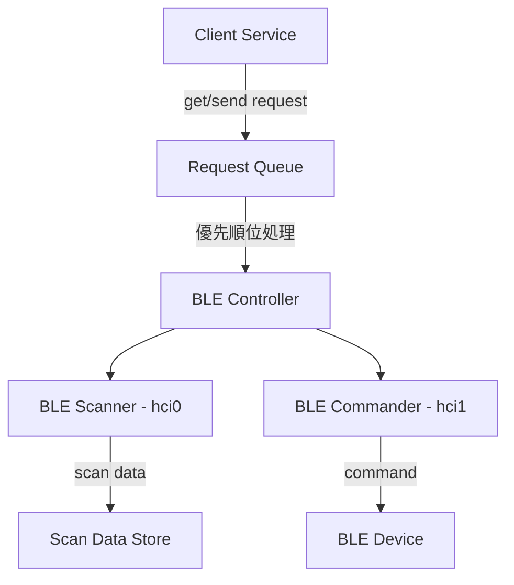

# BLE Controller

Bluetooth Low Energy (BLE) デバイスを制御するためのサービスです。

## 概要

BLE Controller は以下の機能を提供します：

1. BLE デバイスのスキャン (hci0)
2. BLE デバイスへのコマンド送信 (hci1)
3. 優先順位付きリクエストキューによる並行処理の制御

## アーキテクチャ



## 機能詳細

### 1. リクエストキューシステム

非同期リクエストを安全に管理し、順序立てて処理するキューシステムを実装しています。

#### 特徴
- 優先順位付きキュー管理
- タイムスタンプベースの順序制御
- 非同期処理による順次実行
- エラーハンドリング
- メトリクス収集
- リトライ機能

#### RequestTaskインターフェース
```typescript
class RequestTask:
    id: str          # タスクの一意識別子
    type: CommandType # GET/SENDのリクエストタイプ
    url: str         # リクエスト先のエンドポイント
    priority: int    # 優先順位（高いほど優先）
    payload: dict    # リクエストのデータ
    timestamp: float # タスク作成時刻
```

#### 優先順位の仕組み
1. 優先順位の高いタスクが先に処理（priorityの値が大きいほど優先）
2. 同じ優先順位の場合は、タイムスタンプが古いものが優先
3. priorityが未指定の場合は0として扱う

### 2. BLE スキャナー (hci0)

- hci0 アダプタを使用
- 継続的に BLE デバイスをスキャン
- スキャンデータを内部ストアに保存
- データ保持期間: 最新10秒間のデータ

### 3. BLE コマンダー (hci1)

- hci1 アダプタを使用
- クライアントからの要求に応じてデバイスに接続
- コマンドを実行して結果を返却
- 実行後は接続を解除

## API

### GET リクエスト

スキャンデータの取得

```python
# Request
task = RequestTask(
    id="get_1234567890",
    type=CommandType.GET,
    url="/scan_data",
    priority=1,
    payload={"timestamp": "2024-03-20T10:00:00"}
)

# Response
{
    "status": "success",
    "data": [
        {
            "address": "XX:XX:XX:XX:XX:XX",
            "name": "Device Name",
            "rssi": -70,
            "timestamp": "2024-03-20T10:00:05",
            "manufacturer_data": {...}
        }
    ],
    "error": null
}
```

### SEND リクエスト

BLE デバイスへのコマンド送信

```python
# Request
task = RequestTask(
    id="send_1234567890",
    type=CommandType.SEND,
    url="/command",
    priority=2,
    payload={
        "address": "XX:XX:XX:XX:XX:XX",
        "command": "turn_on",
        "parameters": {...}
    }
)

# Response
{
    "status": "success",
    "data": {
        "message": "Command executed successfully"
    },
    "error": null
}
```

## エラーハンドリング

カスタム例外クラスによる詳細なエラー管理：
- BLEControllerError: 基本例外クラス
- QueueProcessingError: キュー処理エラー
- QueueFullError: キューが満杯
- DeviceConnectionError: デバイス接続エラー
- TaskExecutionError: タスク実行エラー

## メトリクス

キューのパフォーマンスモニタリング：
- 処理済みタスク数
- 失敗タスク数
- 平均処理時間
- 直近1000件の処理時間履歴

## 依存関係

- bleak: BLE 通信ライブラリ
- aiohttp: 非同期HTTP通信
- tenacity: リトライ機能
- pytest: テストフレームワーク

## 使用例

```python
from ble_controller import BLEController
from ble_controller.types.request_task import RequestTask, CommandType

# コントローラーの初期化
controller = BLEController()
await controller.start()

# GETリクエストの作成と実行
task = RequestTask(
    id="get_1",
    type=CommandType.GET,
    url="/scan_data",
    priority=1
)
controller.request_queue.enqueue(task)

# キューの完了待機
await controller.wait_for_queue_completion()
```

## テスト

```bash
# テストの実行
pytest tests/
```

## 今後の改善予定

todo

## ライセンス
MIT
